[142. 环形链表 II](https://leetcode.cn/problems/linked-list-cycle-ii/)

快慢指针判断环形链表，这题重点就是要看相遇点和环的起点的关系。

```text
case 1:
    [1] 2 3 4
    2 3 4 1
    3 1 3 1

case 2:
    1 [2] 3 4
    2 3 4
    3 2 4

case 3:
    [1] 2 3
    2 3 1
    3 2 1

case 4:
    1 [2] 3
    2 3
    3 3
```



假设快慢指针相遇的时候慢指针距离起点已经走了K的距离，相遇的点距离环的起点为N，环的长度为M + N，
可以知道:

- 慢指针走的距离：K
- 快指针走的距离：K + M + N

已知快指针的速度是慢指针的速度2倍，所以有:

- 2K = K + M + N
- K = M + N
- K是环的长度

现在要求移动到环的起点，那就要在当前位置再移动N + ?K的距离，N + K刚好是起点到环起点的距离，也就是说此时从起点开始的指针和相遇点开始的指针同时移动，第一次相遇走过的距离刚好是 N + K，所在的点也就是环的起点。


```java
public class Solution {
    public ListNode detectCycle(ListNode head) {
        ListNode ptr0 = head, ptr1 = head;
        while (ptr1 != null) {
            if (ptr1.next == null) return null;
            ptr0 = ptr0.next;
            ptr1 = ptr1.next.next;
            if (ptr0 == ptr1) {
                // 有环
                break;
            }
        }
        if (ptr1 == null) return null;

        // 这里比较重要
        // 让快指针移动到起点与慢指针同时前进，第一次相遇的点就是环的起点
        ptr1 = head;
        while (ptr1 != ptr0) {
            ptr1 = ptr1.next;
            ptr0 = ptr0.next;
        }
        return ptr1;
    }
}
```