[304. 二维区域和检索 - 矩阵不可变](https://leetcode.cn/problems/range-sum-query-2d-immutable/)

```text
1 2 3 4
4 3 2 1 

1   3   6   10
5   10  15
```



如图，sum[i - 1][j] + sum[i][j - 1]会多加一遍sum[i - 1][j - 1]，需要减去多加的部分再加上num[i][j]的值方能得到sum[i][j]的节点：

```text
sum[i][j] = sum[i-1][j] + sum[i][j - 1] - sum[i - 1][j - 1]  + num[i][j];
i < 1, sum[i - 1][j] = 0, sum[i - 1][j - 1] = 0
j < 1, sum[i][j - 1] = 0, sum[i - 1][j - 1] = 0

sum[i][j] = (i < 1 ? 0 : sum[i - 1][j])
    + (j < 1 ? 0 : sum[i][j - 1])
    - (i < 1 || j < 1 ? 0 : sum[i - 1][j - 1])
    + num[i][j]
```



如图，sum[row1 - 1][col2] + sum[row2][col1 - 1]多加了一遍sum[row1 - 1][col1 - 1]，需要减去这部分方能得到绿框和红框合并的区域大小，sum[row2][col2]减去这个区域就是目标的sum。

当然也可以反过来想，减去绿框和红框的面积后，多减去的篮框的部分加回来也可以得出目标sum。

```text
(row2, col2) - (row1, col1) = sum[row2][col2] - sum[row1 - 1][col2] - sum[row2][col1 - 1] + sum[row1 - 1][col1 - 1];
```

```java
class NumMatrix {

    // 前缀和矩阵
    int[][] sums;

    public NumMatrix(int[][] matrix) {
        sums = new int[matrix.length][];
        for(int i = 0; i < matrix.length; i++){
            sums[i] = new int[matrix[i].length];
            for(int j = 0; j < matrix[i].length; j++){
                sums[i][j] = (i < 1 ? 0 : sums[i - 1][j])
                    + (j < 1 ? 0 : sums[i][j - 1])
                    - (i < 1 || j < 1 ? 0 : sums[i - 1][j - 1])
                    + matrix[i][j];
            }
        }
    }
    
    public int sumRegion(int row1, int col1, int row2, int col2) {
        // 这里sums[row2][col1]和sums[row1][col2]是包含在内的，所以要减去1
        // col1 - 1和row1 - 1要考虑边界
        return sums[row2][col2] 
        - (col1 < 1 ? 0 : sums[row2][col1 - 1]) 
        - (row1 < 1 ? 0 : sums[row1 - 1][col2]) 
        + (row1 < 1 || col1 < 1 ? 0 : sums[row1 - 1][col1 - 1]);
    }
}
```

sums是二维前缀和，这样查找的时候时间复杂度就是O(1)

这题也可以用一维前缀和来做，但是查找的时候要再次进行遍历加运算，加出二维的结果，时间复杂度是O(m)

注意点：
- 由于涉及面积的加减，所以题目里的坐标的包含与否要分清楚，要提前想好是否有一个单位的偏移
- 坐标如果需要偏移的话，要考虑偏移后<0的边界情况
