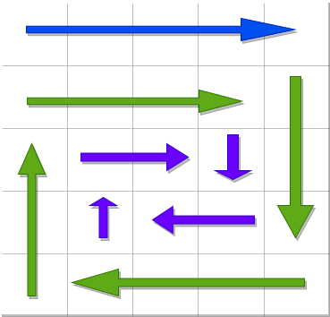

[59. 螺旋矩阵 II](https://leetcode.cn/problems/spiral-matrix-ii/)


1. 每走完一圈，边界+1
2. 因为最内圈的最后一步是向右，所以把“下左上右”当作pattern来处理
3. 且内圈的向右最后一步是走满的，所以把向下的第一个元素让出：

```text
1   2   3   4
12  13  14  5
11  16  15  6
10  9   8   7
```

约定每一步都让出最后一个元素给下一步当作开头

第一步（既要让出尾部7，也要让出头部4）： 5 6
第二步： 7 8 9
第三步： 10 11
第四步（一个pattern最后一步）：12 13 14




```java
class Solution {
    public int[][] generateMatrix(int n) {
        int size = n * n;
        int[][] ans = new int[n][];
        for (int i = 0; i < n; i++) {
            ans[i] = new int[n];
        }
        int e = 1;
        // 填第一行

        for (int i = 0; i < n; i++) {
            ans[0][i] = e;
            e++;
        }

        // 按照下左上右的顺序填
        int bound = 0;
        while (e < size) {
            // 下
            int i = bound + 1;
            for (; i < n - bound - 1; i++) {
                ans[i][n - bound - 1] = e;
                e++;
            }

            // 左
            int j = n - bound - 1;
            for (; j >= bound + 1; j--) {
                ans[i][j] = e;
                e++;
            }

            // 上
            for (; i >= bound + 2; i--) {
                ans[i][j] = e;
                e++;
            }

            // 右
            for (; j < n - bound - 1; j++) {
                ans[i][j] = e;
                e++;
            }

            bound++;
        }
        return ans;
    }
}
```