[396. 旋转函数](https://leetcode.cn/problems/rotate-function/)

### 思路
朴素的做法是遍历计算然后比大小，时间复杂度O(n^2)。

这种题目如果要优化到O(n)或者O(logn)，大概率是要在遍历的时候利用上一次遍历的结果的，因此对于此题可以尝试找一下规律，看一下相邻的遍历步骤的结果有什么关联。

以题目例1的数据为🌰：



可以发现
1. 每次前进的时候都有一部分元素系数+1，如果全部元素系数+1代表整体增加了1 * sum
2. 每次系数增加1的数都是除掉当前起点i的其他数，那也就是增加了sum - nums[i]
3. 当前起点i的数的系数为0，而在前一次该元素的系数应该是最大的，每次最大系数是n - 1，也就是在起点上，每次都会减少(n - 1) * nums[i]

设当前的起始坐标为i，上一次的函数值为p，元素数量n，所有元素的和为sum，那么就有：

```text
当前的函数值c = p + (sum - nums[i]) - (n - 1) * nums[i]
即 
    c = p + sum - n * nums[i]
```

### 解
```java
class Solution {
    public int maxRotateFunction(int[] nums) {
        int ans = func(nums, 0), sum = 0, prev = ans, n = nums.length;
        if(n == 1) return ans;
        for(int i = 0; i < n; i++){
            sum += nums[i];
        }

        // cur = prev + (sum - first) - ((n - 1) * first)
        //     = prev + sum - n * first
        for(int i = n - 1; i > 0; i--){
            int cur = prev + sum - n * nums[i];
            ans = Math.max(cur, ans);
            prev = cur;
        }

        return ans;
    }

    private int func(int[] nums, int f){
        int n = nums.length, ans = 0;
        for(int i = 0; i < n; i++){
            ans += (nums[(f + i) % n] * i);
        }
        return ans;
    }

}
```