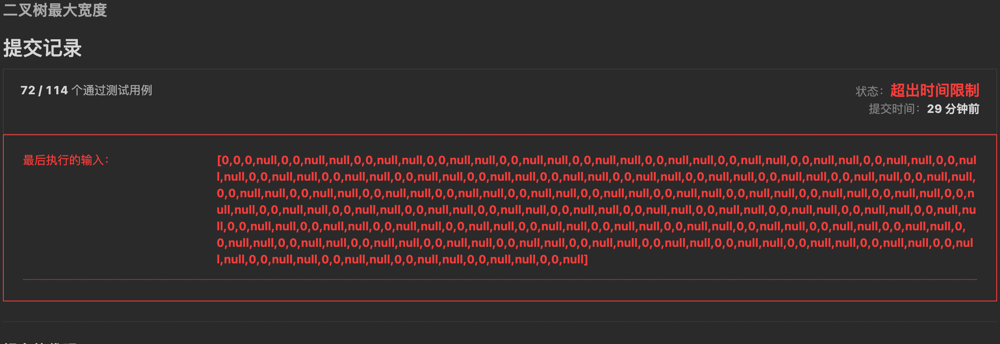

[662. 二叉树最大宽度](https://leetcode.cn/problems/maximum-width-of-binary-tree/)

### 思路

BFS层序遍历

其中每一层遇到非null节点记录一下当前层的节点数，更新最大值

```java
class Solution {
    public int widthOfBinaryTree(TreeNode root) {
        if(root == null) return 0;
        int max = 0, nodeCnt = 0, lineNodeCnt = 0, lineWidth = 0, line = 1;
        boolean firsInLine = false; // 本行是否出现过非null节点
        LinkedList<TreeNode> q = new LinkedList<>();
        q.addFirst(root);
        while(!q.isEmpty()){
            TreeNode node = q.pollLast();
            nodeCnt++;
            // 计算行
            int curLine = (int)Math.floor(Math.log(nodeCnt) / Math.log(2)) + 1;
            if(curLine != line){ // 换行，更新上一行
                line = curLine;
                max = Math.max(max, lineWidth);
                if(lineWidth == 0) break; // 如果上一行宽度是0，说明全部都是null，结束遍历
                lineWidth = 0;
                lineNodeCnt = 0;
                firsInLine = false;
            }
            lineNodeCnt++;
            if(node != null){ // 当前节点不是null，更新width
                if(!firsInLine){
                    firsInLine = true;
                    // 第一次出现非null节点，宽度初始化为1，行节点计数初始化为1
                    lineWidth = 1;
                    lineNodeCnt = 1;
                }else {
                    lineWidth = lineNodeCnt;
                }
            }
            // node是null也要当作有子节点，保证行计算不出问题
            q.addFirst(node == null ? null : node.left);
            q.addFirst(node == null ? null : node.right);
        }
        return max;
    }
}
```

不过由于要遍历null节点，导致这个case会超时（这个树大概有100+层...）


这个case实际的节点数也就100来个，但是100层包含了null节点的话数量就很恐怖了（最后一层达到了2^99个节点...），所以这题考虑对节点编号，用编号去做：`左子节点=父节点*2，右子节点=父节点*2+1`

对于每一层的最大宽度就是节点编号相减+1

然后这里引申一下BFS的两种实现方式

实现1:
```java
void bfs(TreeNode root){
    // 单双端队列，也可用Deque
    LinkedList<TreeNode> q = new LinkedList<>();
    q.addFirst(root);
    while(!q.isEmpty()){
        TreeNode cur = q.pollLast();
        // ...
        q.addFirst(cur.left);
        q.addFirst(cur.right);
    }
}
```

实现2:
```java
void bfs(TreeNode root){
    // 多队列
    List<TreeNode> l = new LinkedList<>();
    l.add(root);
    while(!l.isEmpty()){
        // 保存下一层的所有节点
        List<TreeNode> ll = new LinkedList<>();
        for(TreeNode node : l){
            // ...
            ll.add(node.left);
            ll.add(node.right);
        }
        // 准备遍历下一层
        l = ll;
    }
}
```

这两种实现方式都可以完成对树的BFS，但是第二种方式的`ll`队列中都是同一层的节点，也就是说最外层循环每一层都是同一层节点，第一种实现方式就要借助`Math.floor(Math.log(nodeCnt) / Math.log(2))`来判断层数，写起来会更加复杂。

因此在对层有操作要求（初始化某些变量、按层统计某些数值等等）的情况下，使用第二种实现方式看起来更清晰，能够减少出错的几率。

### 解

BFS + 节点编号

```java
class Solution {
    public int widthOfBinaryTree(TreeNode root) {
        int maxWidth = 0;
        Map<TreeNode, Integer> seq = new HashMap<>();
        seq.put(root, 1); // 初始化root序号
        List<TreeNode> l = new LinkedList<>();
        l.add(root);
        while(!l.isEmpty()){
            List<TreeNode> ll = new LinkedList<>();
            int initialSeq = -1, width = 0;
            for(TreeNode node : l){
                int curSeq = seq.get(node);
                // 计算width
                if(initialSeq != -1) width = curSeq - initialSeq + 1;
                else {
                    initialSeq = curSeq;
                    width = 1;
                }
                maxWidth = Math.max(maxWidth, width);
                // 子节点入队，左=seq*2，右=seq*2+1
                if(node.left != null){
                    ll.add(node.left);
                    seq.put(node.left, curSeq << 1);
                }
                if(node.right != null){
                    ll.add(node.right);
                    seq.put(node.right, curSeq << 1 | 1);
                }
            }
            l = ll;
        }
        return maxWidth;
    }
}
```

另外，这一题可以借助hash，DFS+节点编号也是可以实现的，因为DFS每层优先遍历的都是最左的节点，那么可以在hash中记录层号和编号的对应关系，当hash中不存在的时候保存，存在的时候用当前的编号减去hash中的编号再+1，然后更新最大“宽度”


DFS + 节点编号

```java
class Solution {

    Map<Integer, Integer> levelSeq = new HashMap<>();
    int maxWidth = 0;

    public int widthOfBinaryTree(TreeNode root) {
        dfs(root, 1, 1);
        return maxWidth;
    }

    private void dfs(TreeNode node, int level, int seq){
        if(node == null) return;
        if(!levelSeq.containsKey(level)) levelSeq.put(level, seq);
        maxWidth = Math.max(maxWidth, seq - levelSeq.get(level) + 1);
        // 左右子节点
        if(node.left != null) dfs(node.left, level + 1, seq << 1);
        if(node.right != null) dfs(node.right, level + 1, seq << 1 | 1);
    }
}
```